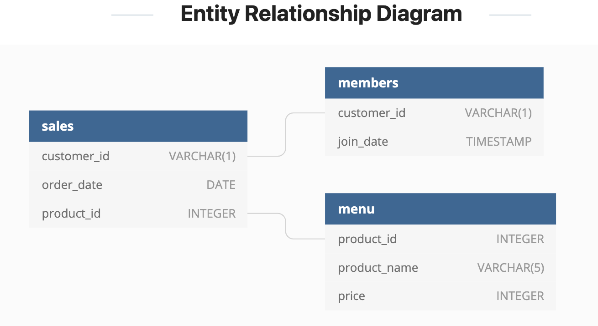

# Week 1 Challenge!

For more information about the <a href="https://8weeksqlchallenge.com/case-study-1/">week 1</a> challenge. 

### Introduction
This week we are looking at Danny's Diner, a Japanese restaurant which began in 2021. The diner needs help staying afloat so they asked me to help with a basic analysis using the limited data that has been gathered.

### Problem Statement
To help stay afloat we have been tasked with answering a few simple questions about the customers of the diner, especially about their visiting patterns, which items are their favorites and how much they have spent. The goal of Danny's Diner after the analysis is over with would be to have enough of an understanding of the customers to expand the existing loyalty program that is already in place.

### Data
Danny is proving me 3 datasets to use for the analysis
 - Sales
 - Menu
 - Members
Along with an entity relationship diagram (ERD henceforth).

