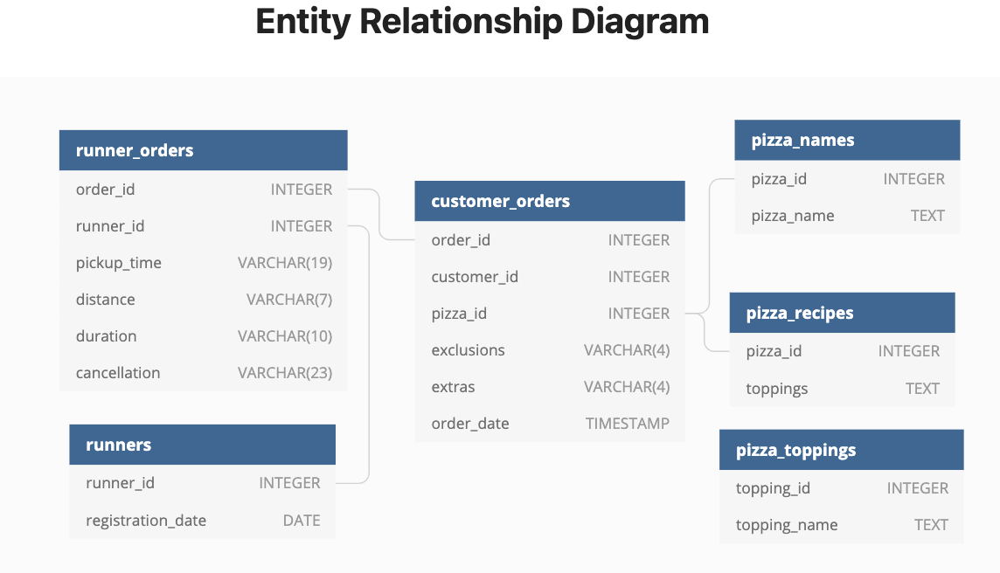

# Week 2 Challenge!

For more information about the <a href="https://8weeksqlchallenge.com/case-study-2/">week 2</a> challenge. 

### Introduction
Danny has created a Pizza restaurant that offers an "Uber" style delivery system called Pizza Runner. We have been given an ERD but the data requires a little bit of cleaning this time so we can better direct runners and optimize Pizza Runner's operations.

### Problem Statement
To help pay off ther credit card debt that Danny has racked up getting Pizza Runner up and sprinting forward, we were asked to help him understand sales on Pizzas. Because we are curious we will also take a look at how well the Runners perform and the Customer Experience. Hopefully Danny is ok that we jog throught the marathon answering all the questions...
### Data
Danny is proving me 6 datasets to use for the analysis
 - runnder_orders
 - runners
 - customer_orders
 - pizza_names
 - pizza_recipes
 - pizza_toppings
Along with an entity relationship diagram (ERD henceforth).

### Data Prep
The data that we were given is not sparkly clean so we'll have to bust out the Mr. Clean Magic Erasers and clean it up some. When we have the data cleaned we'll build temp tables to use in the analysis.

Step 1: customer_orders
  - Convert the null and NaN values into empty strings in the exclusions and extras columns
    - This will indicate that the customer did not alter the pizza

Step 2: runner_orders
 - Convert the 'null' strings into null values for the pickup_time, distance and duration columns.
 - Extract the numeric values in the distance and duration columns
   - I'll use regular expressions and the NULLIF function
 - Convert the 'null' and NaN into null values for cancellations

Both of the customer_orders and runner_orders will be saved into temp tables to not permenately change the raw data.

### Questions
Under Construction 🚧 🚧 🚧

**Stay tuned until the end for any parting thoughts on the challenge and what we could do for further analysese at the end.**
