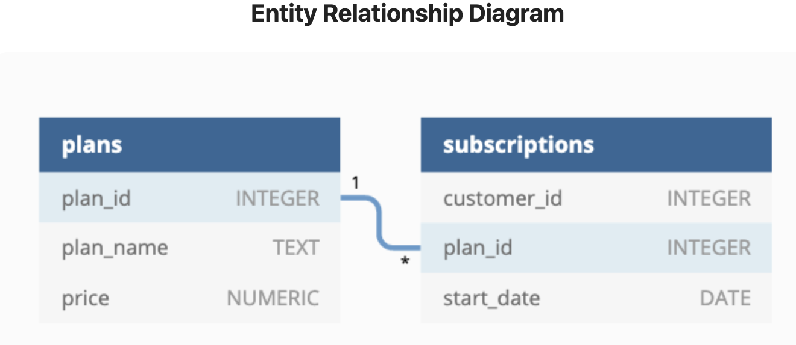

# Week 3 Challenge!

For more information about the <a href="https://8weeksqlchallenge.com/case-study-3/">week 3</a> challenge. 

### Introduction
Danny loves cooking and streaming shows. He realized that there was a large gap in the market, namely, the food related content only streaming network! From this realization, Danny has decided to enlist me as part of the original startup team for Foodie-Fi. Foodie-Fi plans on selling monthly and annual subscriptions, giving their customers unlimited on demand access to world wide food videos.

### Problem Statement
To increase the number of subscriptions, I have been tasked with analyzing digital data about our current users. Danny is looking for a description about each customer's onboarding journey and then the analytical questions.
### Data
Danny is proving me 2 datasets to use for the analysis
 - plans
 - subscriptions

Along with an ERD.

### Questions

Onboarding Customer Journey Description.

Data Analysis Questions:

How many customers has Foodie-Fi ever had?
What is the monthly distribution of trial plan start_date values for our dataset - use the start of the month as the group by value
What plan start_date values occur after the year 2020 for our dataset? Show the breakdown by count of events for each plan_name
What is the customer count and percentage of customers who have churned rounded to 1 decimal place?
How many customers have churned straight after their initial free trial - what percentage is this rounded to the nearest whole number?
What is the number and percentage of customer plans after their initial free trial?
What is the customer count and percentage breakdown of all 5 plan_name values at 2020-12-31?
How many customers have upgraded to an annual plan in 2020?
How many days on average does it take for a customer to an annual plan from the day they join Foodie-Fi?
Can you further breakdown this average value into 30 day periods (i.e. 0-30 days, 31-60 days etc)
How many customers downgraded from a pro monthly to a basic monthly plan in 2020?
