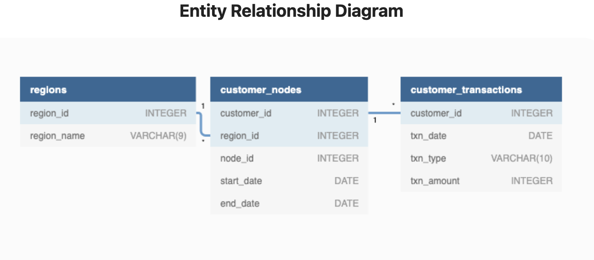

# Week 3 Challenge!

For more information about the <a href="https://8weeksqlchallenge.com/case-study-4/">week 4</a> challenge. 

### Introduction

### Problem Statement

### Data

Along with an ERD.

### Questions

#### Customer Nodes Exploration
How many unique nodes are there on the Data Bank system?
What is the number of nodes per region?
How many customers are allocated to each region?
How many days on average are customers reallocated to a different node?
What is the median, 80th and 95th percentile for this same reallocation days metric for each region?

#### Customer Transactions
What is the unique count and total amount for each transaction type?
What is the average total historical deposit counts and amounts for all customers?
For each month - how many Data Bank customers make more than 1 deposit and either 1 purchase or 1 withdrawal in a single month?
What is the closing balance for each customer at the end of the month?
What is the percentage of customers who increase their closing balance by more than 5%?
