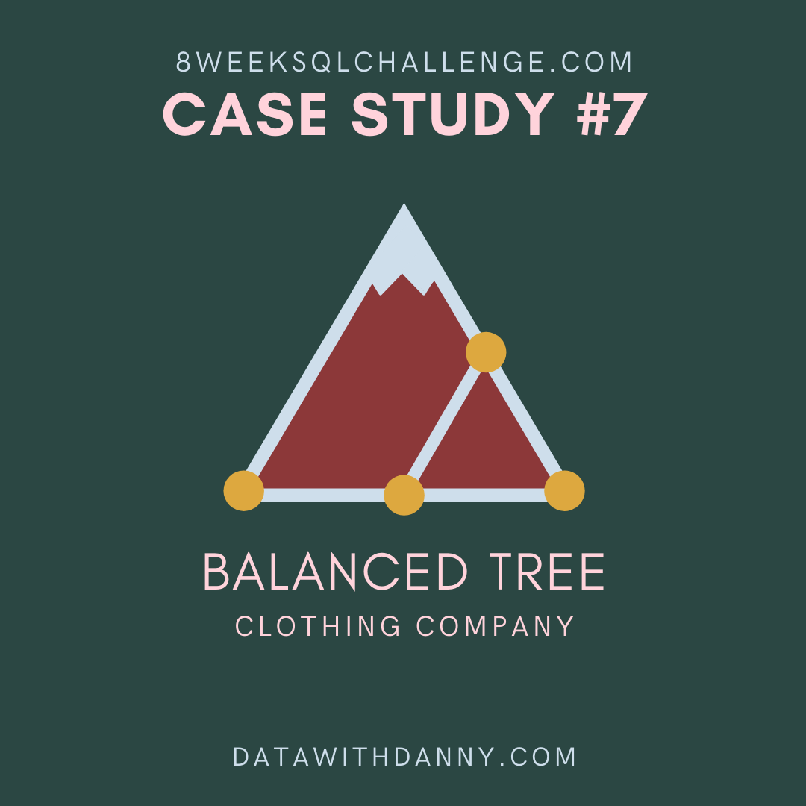

# Week 7 Challenge!


For more information about the <a href="https://8weeksqlchallenge.com/case-study-7/">week 7</a> challenge. 

### Introduction
The Seventh challenge follows the Balanced Tree Clothing Company which prides themselves on providing an optimised range of clothing and lifestyle wear forthe modern adventurer. The CEO Danny, is asking for assistance for the merchandising team as they analyze their sales performance and to generate basic financial reports to share with the wider business.

### High Level Sales Analysis
1. What was the total quantity sold for all products?
```sql
SELECT 
  products.product_name,
  SUM(sales.qty) AS total_quantity
FROM balanced_tree.sales AS sales
JOIN balanced_tree.product_details AS products
ON sales.prod_id = products.product_id
GROUP BY products.product_name
```
| product\_name                    | total\_quantity |
| -------------------------------- | --------------- |
| White Tee Shirt - Mens           | 3800            |
| Navy Solid Socks - Mens          | 3792            |
| Grey Fashion Jacket - Womens     | 3876            |
| Navy Oversized Jeans - Womens    | 3856            |
| Pink Fluro Polkadot Socks - Mens | 3770            |
| Khaki Suit Jacket - Womens       | 3752            |
| Black Straight Jeans - Womens    | 3786            |
| White Striped Socks - Mens       | 3655            |
| Blue Polo Shirt - Mens           | 3819            |
| Indigo Rain Jacket - Womens      | 3757            |
| Cream Relaxed Jeans - Womens     | 3707            |
| Teal Button Up Shirt - Mens      | 3646            |

2. What is the total generated revenue for all products before discounts?
```sql
SELECT
  SUM(price * qty) AS total_revenue
FROM balanced_tree.sales;
```
| total\_revenue |
| -------------- |
| 1289453        |

3. What was the total discount amount for all products?
```sql
SELECT
    SUM(price * qty - discount)
FROM balanced_tree.sales;
```
| sum     |
| ------- |
| 1106753 |

### Transaction Analysis
1. How many unique transactions were there?
```sql
SELECT
    COUNT(DISTINCT txn_id) AS unique_transactions
FROM balanced_tree.sales;
```
| unique\_transactions |
| -------------------- |
| 2500                 |

2. What is the average unique products purchased in each transaction?
```sql
with transaction_cte AS(
  SELECT
    txn_id,
    COUNT(*) AS product_count
  FROM balanced_tree.sales
  GROUP BY txn_id
)

SELECT
  ROUND(AVG(product_count)) AS average_purchases
FROM transaction_cte
```
| average\_purchases |
| ------------------ |
| 6                  |

3. What are the 25th, 50th and 75th percentile values for the revenue per transaction?
```sql
with rev_percentile_cte AS(
  SELECT
    txn_id,
    SUM(qty * price) AS revenue
  FROM balanced_tree.sales
  GROUP BY txn_id
)

SELECT
  PERCENTILE_CONT(0.25) WITHIN GROUP (ORDER BY revenue)AS pct_25,
  PERCENTILE_CONT(0.5) WITHIN GROUP (ORDER BY revenue)AS pct_50,
  PERCENTILE_CONT(0.75) WITHIN GROUP (ORDER BY revenue)AS pct_75
FROM rev_percentile_cte
```
| pct\_25 | pct\_50 | pct\_75 |
| ------- | ------- | ------- |
| 375.75  | 509.5   | 647     |

4. What is the average discount value per transaction?
```sql
with discount_cte AS(
  SELECT
    txn_id,
    SUM(qty * price * discount) AS total_discount
  FROM balanced_tree.sales
  GROUP BY txn_id
)

SELECT
  ROUND(AVG(total_discount)/100, 2) AS average_discount
FROM discount_cte
```
| average\_discount |
| ----------------- |
| 62.49             |
5. What is the percentage split of all transactions for members vs non-members?
```sql
with member_cte AS(
  SELECT
    member,
    COUNT(DISTINCT txn_id) AS total_transaction
  FROM balanced_tree.sales
  GROUP BY member
)

SELECT
  member,
  total_transaction,
  ROUND((total_transaction / SUM(total_transaction) OVER()),2) AS percentage
FROM member_cte
GROUP BY member, total_transaction
```
| member | total\_transaction | percentage |
| ------ | ------------------ | ---------- |
| FALSE  | 995                | 0.40       |
| TRUE   | 1505               | 0.60       |

6. What is the average revenue for member transactions and non-member transactions?
```sql
with member_rev_cte AS(
  SELECT
    member,
    txn_id,
    SUM(qty * price) AS total_rev
  FROM balanced_tree.sales
  GROUP BY member, txn_id
)

SELECT
  member,
  PERCENTILE_CONT(.5) WITHIN GROUP (ORDER BY total_rev) AS average_revenue
FROM member_rev_cte
GROUP BY member
```
| member | average\_revenue |
| ------ | ---------------- |
| FALSE  | 508              |
| TRUE   | 511              |

### Product Analysis
1. What are the top 3 products by total revenue before discount?
```sql
SELECT
  prod.product_name AS product,
  SUM(sales.qty * sales.price) AS total_revenue
FROM balanced_tree.sales AS sales
JOIN balanced_tree.product_details AS prod
ON sales.prod_id = prod.product_id
GROUP BY product
ORDER BY 2 DESC
LIMIT 3
```
| product                      | total\_revenue |
| ---------------------------- | -------------- |
| Blue Polo Shirt - Mens       | 217683         |
| Grey Fashion Jacket - Womens | 209304         |
| White Tee Shirt - Mens       | 152000         |

2. What is the total quantity, revenue and discount for each segment?
```sql
SELECT
  prod.segment_name AS segment,
  SUM(sales.qty) AS quantity,
  SUM(sales.qty * sales.price) AS total_revenue,
  ROUND(
    SUM(sales.qty * sales.price * sales.discount / 100), 2) AS total_discount
FROM balanced_tree.sales AS sales
JOIN balanced_tree.product_details AS prod
ON sales.prod_id = prod.product_id
GROUP BY segment_name
ORDER BY 3 DESC
```
| segment | quantity | total\_revenue | total\_discount |
| ------- | -------- | -------------- | --------------- |
| Shirt   | 11265    | 406143         | 48082.00        |
| Jacket  | 11385    | 366983         | 42451.00        |
| Socks   | 11217    | 307977         | 35280.00        |
| Jeans   | 11349    | 208350         | 23673.00        |

3. What is the top selling product for each segment?
```sql
with rank_final_cte AS(
SELECT
  prod.segment_name AS segment,
  prod.product_name AS product,
  SUM(sales.qty) AS total_quantity,
  RANK() OVER(PARTITION BY prod.segment_name ORDER BY SUM(sales.qty) DESC) AS top_selling
FROM balanced_tree.sales AS sales
JOIN balanced_tree.product_details AS prod
ON sales.prod_id = prod.product_id
GROUP BY 1,2
)

SELECT
  segment,
  product,
  total_quantity
FROM rank_final_cte
WHERE top_selling = 1
```
| segment | product                       | total\_quantity |
| ------- | ----------------------------- | --------------- |
| Jacket  | Grey Fashion Jacket - Womens  | 3876            |
| Jeans   | Navy Oversized Jeans - Womens | 3856            |
| Shirt   | Blue Polo Shirt - Mens        | 3819            |
| Socks   | Navy Solid Socks - Mens       | 3792            |

4. What is the total quantity, revenue and discount for each category?
What is the top selling product for each category?
What is the percentage split of revenue by product for each segment?
What is the percentage split of revenue by segment for each category?
What is the percentage split of total revenue by category?
What is the total transaction “penetration” for each product? (hint: penetration = number of transactions where at least 1 quantity of a product was purchased divided by total number of transactions)
What is the most common combination of at least 1 quantity of any 3 products in a 1 single transaction?